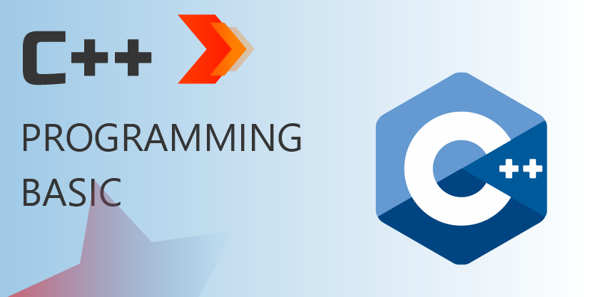
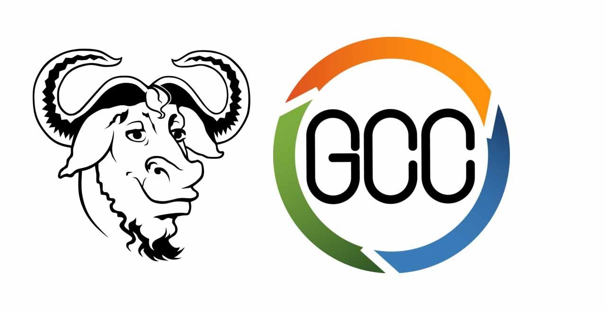
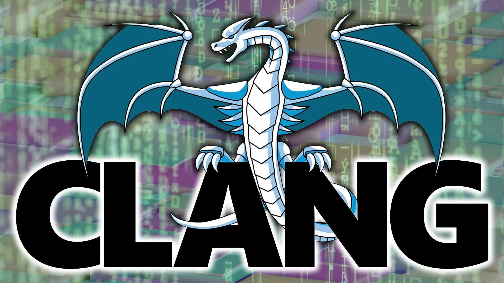

# C++ 编程环境入门

## 开篇


在当今的技术世界中，C++作为一种强大且灵活的编程语言，广泛应用于系统软件、游戏开发、嵌入式系统以及高性能应用等多个领域。无论你是编程新手还是有经验的开发者，掌握C++都将为你的职业生涯打开新的大门。为了帮助你顺利入门，我们将探讨如何设置一个高效的C++编程环境，涵盖从选择合适的操作系统和开发工具，到配置编译器和调试器的各个方面。

正如古语所言：“工欲善其事，必先利其器。”计算机科学是一门偏实践的学科，编程更需要大量的实践，包括手动编写、阅读、评审和调试代码。因此，在深入理解语法糖和黑魔法之前，让我们先准备好手中的武器，这样才能在编程的道路上劈荆斩棘，仗剑行走江湖。通过这一系列的指导，你将能够建立一个坚实的基础，开始你的C++编程之旅，探索这门语言的无限可能性。

## 运行环境配置

如果你手上的操作系统是 Windows，那我强烈建议你把编程环境搭在 Linux 上，哪怕是装个虚拟机。因为现实世界中，大部分公司的编程环境都是 Linux，而 Linux 系统上有许多趁手的工具，也更方便定制开发环境和便于程序自动化。常见的选择有 Ubuntu、Debian、Fedora 等发行版。你可以使用 WSL（Windows Subsystem for Linux）、VirtualBox 或 VMware 安装 Linux 虚拟机。
如果你不适应全命令行的环境，Ubuntu的图形化界面会相对来说容易适应。

### C++开发环境选择Linux系统的理由

将C++的开发环境设置为Linux系统有多个优点，以下是一些主要原因：

| 优点                     | 说明                                                                   |
| ------------------------ | ---------------------------------------------------------------------- |
| **开源和自由**           | Linux是开源的，开发者可以自由修改和分发代码，适合学习和实验。          |
| **强大的命令行工具**     | Linux提供了丰富的命令行工具，方便进行编译、调试和版本控制等操作。      |
| **良好的性能**           | Linux系统通常对资源的管理更高效，适合开发高性能的C++应用。             |
| **广泛的社区支持**       | Linux拥有活跃的开发者社区，提供丰富的文档、教程和支持。                |
| **兼容性和移植性**       | C++在Linux上开发的程序通常更容易移植到其他Unix-like系统。              |
| **开发工具和库的丰富性** | Linux支持多种开发工具和库，如GCC、Clang、CMake等，方便进行开发和构建。 |
| **多线程和网络编程支持** | Linux对多线程和网络编程的支持非常好，适合开发复杂的应用程序。          |
| **安全性**               | Linux系统相对安全，适合开发需要高安全性的应用。                        |

### 编译器安装

在Ubuntu上，安装C++编译器是进行C++开发的第一步。最常用的编译器包括**GCC**（GNU Compiler Collection）和**Clang**。以下是这两种编译器的安装步骤和基本介绍。

#### GCC（GNU Compiler Collection）

GCC是一个功能强大的编译器，支持多种编程语言，包括C和C++。它是Linux环境中最常用的编译器之一。

安装步骤如下：

1. **更新软件包列表**：
   打开终端，输入以下命令以确保软件包列表是最新的：
   ```bash
   sudo apt update
   ```

2. **安装GCC**：
   使用以下命令安装GCC及其C++编译器：
   ```bash
   sudo apt install build-essential
   ```
   这个命令会安装GCC、G++（C++编译器）以及其他一些开发工具。

3. **验证安装**：
   安装完成后，可以通过以下命令检查GCC的版本：
   ```bash
   gcc --version
   ```

   检查G++的版本：
   ```bash
   g++ --version
   ```

#### Clang

Clang是一个现代化的C/C++编译器，提供了更快的编译速度和更好的错误提示。它是LLVM项目的一部分，广泛用于开发和研究。

安装步骤如下：

1. **更新软件包列表**：
   同样，首先更新软件包列表：
   ```bash
   sudo apt update
   ```

2. **安装Clang**：
   使用以下命令安装Clang：
   ```bash
   sudo apt install clang
   ```

3. **验证安装**：
   安装完成后，可以通过以下命令检查Clang的版本：
   ```bash
   clang --version
   ```

在Ubuntu上安装GCC和Clang非常简单。GCC是一个成熟且广泛使用的编译器，适合大多数C++开发需求；而Clang则提供了更现代的编译体验，适合需要快速反馈和高效编译的开发者。根据个人需求选择合适的编译器，将为你的C++开发之旅打下坚实的基础。


## 编辑器推荐

在C++程序设计中，选择合适的编辑器可以显著提高开发效率和代码质量。这里说的是编辑器，首先明确一下编辑器和IDE的区别。IDE，全称为集成开发环境（Integrated Development Environment），最常见的例子包括微软公司的Visual Studio，它不仅包含编辑器，还集成了编译器和调试工具等功能。而常见的编辑器，如记事本，甚至微软的Word，从某种意义上来说，也是一种编辑器，不过我们习惯称之为文本编辑器。

对于C++开发者，推荐的免费编辑器有VS Code、Sublime Text、Vim和Emacs等，这些编辑器轻量且支持多种编程语言和插件，能够满足不同开发者的需求。对于需要更强大功能的开发者，收费的选项如Clion（跨平台）和Visual Studio（仅适用于Windows）也是不错的选择。这些工具各有特点，开发者可以根据自己的需求和使用习惯进行选择。

在Ubuntu上安装这些主流编辑器非常简单，可以自行谷歌，这里就不过多介绍。每种编辑器都有其独特的功能和优点，开发者可以根据自己的需求和使用习惯进行选择。无论是轻量级的VS Code和Sublime Text，还是功能强大的Vim和Emacs，合适的编辑器将为你的C++开发之旅提供强有力的支持。关于 VS Code的配置，如果需要，会单独开一篇介绍，这里就不再赘述。

## 第一个程序 Hello World !

前面介绍了编译环境和编辑器，目前为止，基本的运行环境已经搭建完毕，即，你已经可以开始编写 C++ 程序练手了，至少刷leetcode是没问题了。至于cmake、bazel、ninja之类的构建工具需对于目前的你来说还暂时不需要，当务之急是专注于语言层面，`talk is cheap, show me your code !`
下面是一个简单的 C++ Hello World 程序：

```cpp
// hello.cpp
#include <iostream>

int main() {
    std::cout << "Hello World!" << std::endl;
}
```

编译命令（在 Linux 终端或 Windows 的 WSL/MinGW 环境下）：

**gcc 编译及运行**
```sh
g++ hello.cpp -o hello
./hello
```

**clang 编译及运行**
```sh
clang++ ./hello.cpp -o hello
./hello
```

输出结果：

```
Hello, World!
```


## 结语

在C++编程的旅程中，初始的学习阶段可能会让人感到挑战重重，但请记住，完事开头难，恭喜你已经成功迈出第一步。编程是一项需要不断探索和实践的技能，随着你对语言的理解加深和实践经验的积累，你会发现编程的乐趣和成就感。后续只需坚持实践，逐步提升编程能力。勇敢地面对挑战，积极地解决问题，你将会在这条道路上收获丰硕的成果。继续探索，享受编程的每一个瞬间！

## 参考资料

以下是一些有用的网络资源链接，可以作为C++编程环境的参考：

1. **C++官方文档**：
   - [C++ Reference](https://en.cppreference.com/w/)：提供C++标准库和语言特性的详细文档。

2. **在线教程**：
   - [LearnCpp](https://www.learncpp.com/)：一个全面的C++教程，适合初学者和有经验的开发者。
   - [C++ Tutorial by cplusplus.com](http://www.cplusplus.com/doc/tutorial/)：提供基础到高级的C++教程。

3. **编译器和开发环境**：
   - [GCC官方网站](https://gcc.gnu.org/)：获取GCC编译器的最新版本和文档。
   - [Clang官方网站](https://clang.llvm.org/)：获取Clang编译器的最新版本和文档。
   - [WSL 官方文档](https://learn.microsoft.com/zh-cn/windows/wsl/tutorials/wsl-vscode)

4. **开发工具**：
   - [Visual Studio Code](https://code.visualstudio.com/)：下载和了解VS Code的使用。
   - [Sublime Text](https://www.sublimetext.com/)：获取Sublime Text的下载和使用指南。

5. **社区和论坛**：
   - [Stack Overflow](https://stackoverflow.com/questions/tagged/c%2b%2b)：一个活跃的编程问答社区，可以在这里提问和寻找C++相关问题的答案。
   - [Reddit - r/cpp](https://www.reddit.com/r/cpp/)：C++开发者的社区，分享资源和讨论。

这些资源将帮助你更好地理解C++编程环境，并为你的学习和开发提供支持。
